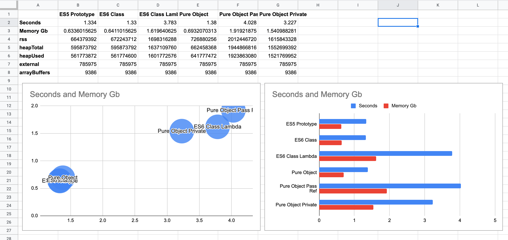

# JS OOP Perf

Super quick test of different OOP operations in JavaScript.

For example, comparing Pure Object Composition:

```js
// Pure Object Composition

function print() {
  return `${this.id}, ${this.name}`;
}

const Person = (id, name) => ({
  id,
  name,
  print,
});
```

... with ES6 Classes:

```js
// ES6 Class

class Person {
  constructor(id, name) {
    this.id = id;
    this.name = name;
  }

  print() {
    return `${this.id}, ${this.name}`;
  }
}
```

## Usage

```shell
node pure-object-composition.js 10000000  # < iterations
```

[](./terminal-output.png)

## Results

This chart shows ten million iterations of the class/object being:

1. Instantiated
2. Print()'ed
3. Pushed to an array

[](./perf-chart.png)

### System Under Test

- **OS:** macOS Catalina
- **CPU:** 2.4 GHz 8-Core Intel Core i9
- **RAM:** 32 GB 2667 MHz DDR4
- **Env:** Node.js v14.6.0
